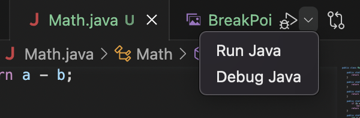
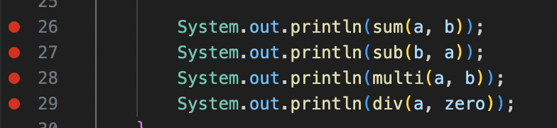

# VSCode에서 디버깅

- VSCode에서 우측 상단의 Debug Java를 실행하면 디버깅을 실행할 수 있음.
    - 

## break point
1. 디버깅을 하기 위해서는 break point를 지정
2. break point마다 멈춤.
    - 

## debug 관련 기능
- `continue(F5)` -> 다음 break point를 만날때까지 계속 진행
- `Step Over(F10)` -> 한 줄 실행
- `Step Into(F11)` -> 함수 내부로 들어감
- `Step Out(shift+F11)` -> 함수를 끝까지 실행시키고 호출시킨 곳으로 되돌아감
- `Restart(shift+command+F5)` -> 재시작
- `Stop(shift+F5)` -> 디버깅 중지
- `Hot Code Replace` -> 이클립스 자바 디버거 동작 중에 새로운 클래스 파일의 변경이 있으면 그 변경된 파일을 자동으로 교체하는 디버깅 기술